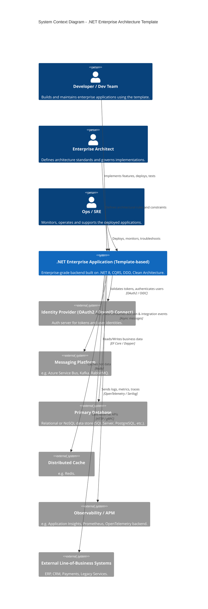
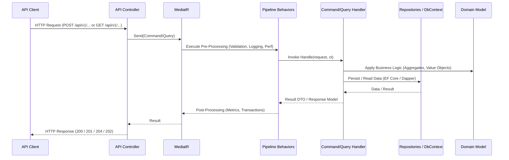
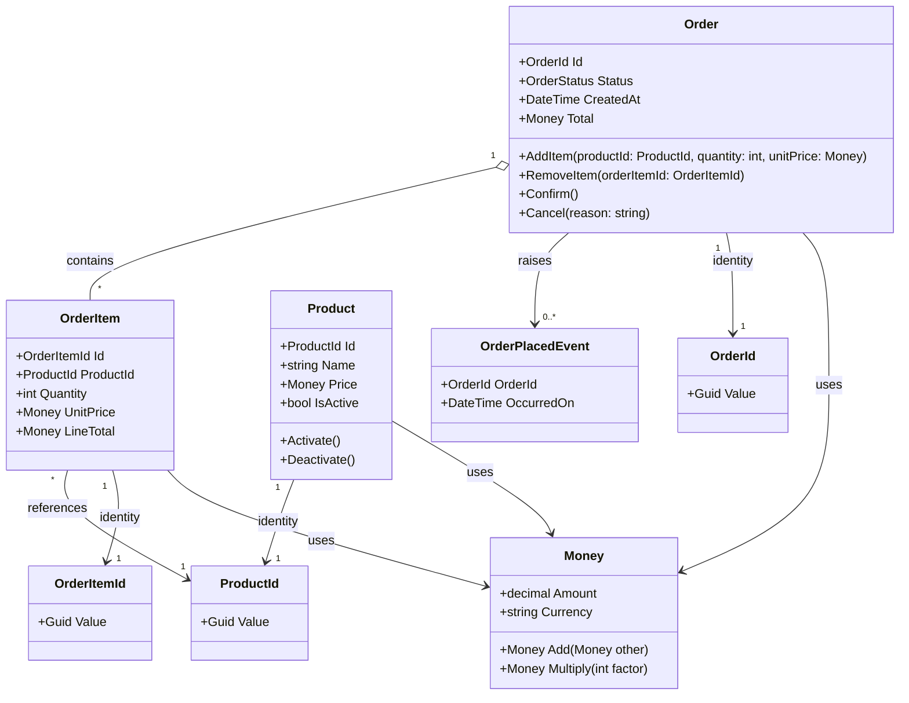

# .NET Enterprise Architecture Template

**Technical Specification Document**

---

## Document Control

| Attribute | Value |
|-----------|-------|
| Document Version | 1.0 |
| Status | Active |
| Document Type | Architecture Reference Implementation |
| Target Audience | Enterprise Architects, Technical Leads, Development Teams |
| Classification | Internal/Public |
| Last Updated | 2025 |

---

## Executive Summary

This document presents a production-grade .NET 8 enterprise architecture template designed for building scalable, maintainable, and cloud-ready applications. The template implements industry-standard architectural patterns including Clean Architecture, Command Query Responsibility Segregation (CQRS), and Domain-Driven Design (DDD). It provides a comprehensive foundation for enterprise systems, microservices architectures, and API-driven backends, incorporating observability, structured logging, and modern development practices aligned with SOLID principles and enterprise governance frameworks.

**Key Value Propositions:**
- Accelerated time-to-market through proven architectural patterns
- Reduced technical debt via standardized structure and separation of concerns
- Enhanced maintainability through clear dependency management
- Production-ready observability and operational excellence
- Framework-agnostic domain layer ensuring long-term sustainability

---

## Table of Contents

1. Introduction and Scope
2. Architectural Foundation
3. Technical Stack and Dependencies
4. Solution Structure and Organization
5. Core Features and Capabilities
6. Implementation Examples
7. Quality Assurance Strategy
8. Deployment and Operations
9. Documentation Resources
10. Governance and Contribution Guidelines
11. Glossary
12. Recommendations and Next Steps

---

## 1. Introduction and Scope

### 1.1. Purpose

This template provides a reference implementation for enterprise-grade .NET applications, addressing common architectural challenges in modern software development. It serves as both a starting point for new projects and a learning resource for development teams seeking to implement proven patterns.

### 1.2. Target Systems

The architecture is optimized for:
- Enterprise business applications
- Microservices-based distributed systems
- RESTful API backends
- Domain-centric modular monoliths
- Cloud-native applications (Azure, AWS, containerized environments)

### 1.3. Scope and Boundaries

**In Scope:**
- Application architecture and structure
- Core technical patterns and implementations
- Development practices and conventions
- Testing strategies
- Deployment foundations

**Out of Scope:**
- Business domain-specific logic
- Infrastructure provisioning scripts
- Specific cloud provider implementations
- User interface implementations
- Database-specific optimizations

### 1.4. Compliance and Standards Alignment

This template aligns with:
- ISO/IEC/IEEE 26515:2018 for software documentation
- SOLID principles for object-oriented design
- TOGAF 10 principles for enterprise architecture
- ITIL 4 for operational practices
- IEEE 830 for requirements specification structure

---

## 2. Architectural Foundation

### 2.1. Architectural Principles

#### 2.1.1. Clean Architecture Implementation

The template implements Clean Architecture with strict layer separation and dependency inversion:

- **Domain Layer:** Core business logic, independent of external concerns
- **Application Layer:** Use case orchestration, business workflows
- **Infrastructure Layer:** External concerns, data access, third-party integrations
- **Presentation Layer:** API controllers, HTTP concerns, request/response handling

#### 2.1.2. Dependency Rule

All dependencies point inward toward the domain. Outer layers may depend on inner layers, but inner layers remain independent of outer layer implementations.

### 2.2. Architectural Patterns

#### 2.2.1. Command Query Responsibility Segregation (CQRS)

Separates read and write operations into distinct models:

- **Commands:** State-changing operations with business logic validation
- **Queries:** Read-only operations optimized for data retrieval
- **Handlers:** Isolated processing units for each command or query

#### 2.2.2. Mediator Pattern

Implements request/response messaging through MediatR:

- Decouples request initiators from handlers
- Enables cross-cutting concerns via pipeline behaviors
- Simplifies testing through isolated handler units

#### 2.2.3. Domain-Driven Design (DDD)

Incorporates tactical DDD patterns:

- **Entities:** Objects with unique identity and lifecycle
- **Value Objects:** Immutable objects defined by attributes
- **Aggregates:** Consistency boundaries for related entities
- **Domain Events:** State change notifications within domain boundaries
- **Specifications:** Reusable business rule expressions

### 2.2.4. System Context Diagram


### 2.3. Architectural Layers

#### 2.3.1. Layer Definitions

```
┌─────────────────────────────────────────┐
│          Presentation Layer             │
│         (API Controllers)               │
├─────────────────────────────────────────┤
│         Application Layer               │
│    (Commands, Queries, Handlers)        │
├─────────────────────────────────────────┤
│           Domain Layer                  │
│  (Entities, Value Objects, Events)      │
├─────────────────────────────────────────┤
│        Infrastructure Layer             │
│   (Persistence, External Services)      │
└─────────────────────────────────────────┘
```

#### 2.3.2. Vertical Slice Architecture

Each feature is organized as a vertical slice containing all layers:

- Improved cohesion within feature boundaries
- Reduced coupling between features
- Simplified feature-based development and testing
- Clear ownership and responsibility boundaries

#### 2.3.3. Clean Architecture Layer Diagram
```mermaid
flowchart TB
    subgraph Presentation["Presentation Layer (API)"]
        controller[API Controllers<br/>HTTP Endpoints, Filters, Middleware]
    end

    subgraph Application["Application Layer (Use Cases)"]
        commands[Commands & Command Handlers]
        queries[Queries & Query Handlers]
        behaviors[Pipeline Behaviors<br/>(Validation, Logging, Transactions)]
        appServices[Application Services / Orchestrators]
    end

    subgraph Domain["Domain Layer (Core Business)"]
        entities[Entities & Aggregates]
        valueObjects[Value Objects]
        domainEvents[Domain Events]
        specs[Specifications]
        domainServices[Domain Services]
    end

    subgraph Infrastructure["Infrastructure Layer"]
        efCore[EF Core DbContext & Configurations]
        dapper[Dapper Read Models / Repositories]
        external[External Service Clients<br/>(Email, File Storage, 3rd-party APIs)]
        messaging[Message Broker Integrations]
    end

    controller --> commands
    controller --> queries

    commands --> entities
    commands --> domainServices
    commands --> domainEvents

    queries --> dapper
    queries --> efCore

    behaviors --> commands
    behaviors --> queries

    Infrastructure --> Application
    Application --> Domain

    style Domain fill:#fdf5d3,stroke:#b39b5e,stroke-width:1px
    style Application fill:#e3f2fd,stroke:#64b5f6,stroke-width:1px
    style Presentation fill:#fce4ec,stroke:#f06292,stroke-width:1px
    style Infrastructure fill:#ede7f6,stroke:#9575cd,stroke-width:1px


```

## 3. Technical Stack and Dependencies

### 3.1. Core Technologies

#### 3.1.1. Platform

- **.NET 8:** Long-term support release with enhanced performance
- **ASP.NET Core Web API:** HTTP-based service framework
- **C# 12:** Language features and syntax

#### 3.1.2. Architectural Libraries

- **MediatR:** In-process messaging and request handling
- **FluentValidation:** Declarative validation rules
- **Mapster or AutoMapper:** Object-to-object mapping

#### 3.1.3. Data Access

- **Entity Framework Core:** Object-relational mapping for write operations
- **Dapper:** Micro-ORM for optimized read operations
- **Repository Pattern:** Optional abstraction over data access

#### 3.1.4. Observability Stack

- **Serilog:** Structured logging framework
- **OpenTelemetry:** Distributed tracing and metrics
- **Application Insights:** Optional cloud-based monitoring

### 3.2. Supported Data Stores

The template supports multiple database systems:

- Microsoft SQL Server
- PostgreSQL
- Azure SQL Database
- MongoDB (for specific scenarios)

### 3.3. Integration Capabilities

Optional integration patterns for:

- **Caching:** Redis, in-memory cache
- **Messaging:** Azure Service Bus, Apache Kafka, RabbitMQ
- **API Gateway:** Integration-ready structure
- **Identity Providers:** OAuth 2.0, OpenID Connect compatibility

### 3.4. Development Tools

- **Docker:** Containerization support
- **Docker Compose:** Local development environment
- **GitHub Actions:** Continuous integration templates
- **xUnit:** Testing framework

---

## 4. Solution Structure and Organization

### 4.1. Project Organization

```
dotnet-enterprise-architecture-template/
│
├── src/
│   ├── Api/
│   ├── Application/
│   ├── Domain/
│   ├── Infrastructure/
│   └── Shared/
│
├── tests/
│   ├── UnitTests/
│   └── IntegrationTests/
│
├── docs/
│   ├── architecture/
│   ├── domain/
│   ├── api/
│   └── README.md
│
└── README.md
```

### 4.2. Source Code Structure

#### 4.2.1. Api Project

**Responsibility:** HTTP request handling and API concerns

**Contents:**
- Controllers implementing RESTful endpoints
- Middleware components for cross-cutting concerns
- Exception filters and global error handling
- API versioning configuration
- Dependency injection container setup
- Application startup and configuration

#### 4.2.2. Application Project

**Responsibility:** Use case orchestration and application workflows

**Contents:**
- Commands representing write operations
- Queries representing read operations
- Request handlers implementing business workflows
- Data Transfer Objects (DTOs) for external communication
- Pipeline behaviors for cross-cutting concerns
- Validation rules using FluentValidation
- Mapping profiles for object transformations
- Application-level abstractions and interfaces

**Subdirectories:**
- `Behaviors/` - MediatR pipeline behaviors (logging, validation, metrics)
- `Common/` - Shared application logic and abstractions
- `Commands/` - Write operation requests and handlers
- `Queries/` - Read operation requests and handlers

#### 4.2.3. Domain Project

**Responsibility:** Core business logic and domain model

**Contents:**
- Entity classes with business identity
- Value objects representing domain concepts
- Aggregate roots managing consistency boundaries
- Domain events for state change notifications
- Specification patterns for business rules
- Domain service interfaces
- Domain exceptions

**Dependencies:** None (zero external dependencies)

#### 4.2.4. Infrastructure Project

**Responsibility:** Implementation of external concerns

**Contents:**
- Entity Framework Core DbContext
- Database migrations
- Repository implementations
- Dapper query implementations
- External service integrations
- File system operations
- Email service implementations
- Third-party API clients

**Subdirectories:**
- `Persistence/` - Database context, configurations, migrations
- `Services/` - External service implementations
- `Migrations/` - Database schema migrations

#### 4.2.5. Shared Project

**Responsibility:** Cross-cutting utilities and common code

**Contents:**
- Extension methods
- Utility classes
- Constants and enumerations
- Result pattern implementations
- Common data structures

### 4.3. Naming Conventions

#### 4.3.1. Project Naming

Format: `[CompanyName].[ProjectName].[Layer]`

Example: `Contoso.ECommerce.Domain`

#### 4.3.2. File Organization

- One class per file
- File name matches class name
- Folder structure reflects namespace structure

#### 4.3.3. Namespace Convention

Format: `[CompanyName].[ProjectName].[Layer].[Feature].[Component]`

Example: `Contoso.ECommerce.Application.Orders.Commands`

---

## 5. Core Features and Capabilities

### 5.1. Clean Architecture Implementation

#### 5.1.1. Dependency Inversion

All layer dependencies follow the dependency rule:
- Domain has zero dependencies
- Application depends only on Domain
- Infrastructure depends on Application and Domain
- API depends on all layers for composition only

#### 5.1.2. Interface-Based Abstractions

External concerns are defined as interfaces in inner layers and implemented in outer layers.

### 5.2. CQRS and Mediator Pipeline

#### 5.2.1. Command Processing

**Command Flow:**
1. API receives HTTP request
2. Controller creates command object
3. Command sent to MediatR
4. Pipeline behaviors execute (validation, logging)
5. Command handler processes business logic
6. Response returned through pipeline

#### 5.2.2. Query Processing

**Query Flow:**
1. API receives HTTP request
2. Controller creates query object
3. Query sent to MediatR
4. Pipeline behaviors execute
5. Query handler retrieves data (optimized for reads)
6. Response mapped to DTO and returned

#### 5.2.3. Pipeline Behaviors

Cross-cutting concerns implemented as behaviors:

- **Validation Behavior:** Executes FluentValidation rules before handler
- **Logging Behavior:** Structured logging of requests and responses
- **Performance Behavior:** Monitors execution time and logs slow requests
- **Transaction Behavior:** Manages database transactions for commands
- **Exception Behavior:** Consistent exception handling and transformation

#### 5.2.4. CQRS / Mediator Flow Diagram




### 5.3. Domain-Driven Design Implementation

#### 5.3.1. Tactical Patterns

**Entity Pattern:**
- Objects with unique identity
- Lifecycle management
- Business rule enforcement

**Value Object Pattern:**
- Immutable objects
- Defined by attributes, not identity
- Self-validating

**Aggregate Pattern:**
- Consistency boundary
- Single root entity
- Controlled access to internal entities

**Domain Event Pattern:**
- State change notifications
- Decoupled domain logic
- Event-driven workflows

**Specification Pattern:**
- Reusable business rules
- Composable conditions
- Centralized validation logic

#### 5.3.2. Rich Domain Model

The domain model encapsulates business logic rather than exposing anemic data structures:

- Business rules within entities
- Domain validation at object construction
- Protected state modifications
- Meaningful domain operations

#### 5.3.3. Example Domain Model Diagram (Catalog / Orders)



### 5.4. Enterprise Logging

#### 5.4.1. Structured Logging with Serilog

**Features:**
- Structured log events with typed properties
- Multiple sink support (file, database, cloud)
- Contextual enrichment
- Correlation ID tracking
- Performance-optimized

**Standard Enrichers:**
- Machine name
- Environment name
- Correlation ID
- User identity
- Request path

#### 5.4.2. Log Levels and Usage

- **Verbose:** Detailed diagnostic information
- **Debug:** Internal system events for debugging
- **Information:** General informational messages
- **Warning:** Unexpected but handled situations
- **Error:** Errors and exceptions requiring attention
- **Fatal:** Critical failures requiring immediate action

### 5.5. Validation Layer

#### 5.5.1. FluentValidation Integration

Declarative validation rules for all commands and queries:

- Type-safe validation expressions
- Reusable validation rules
- Async validation support
- Custom validation logic
- Localization support

#### 5.5.2. Validation Pipeline

Validation executes automatically before handler execution via pipeline behavior, returning structured validation errors when rules fail.

### 5.6. Data Access Strategy

#### 5.6.1. Hybrid Approach

**Entity Framework Core for Writes:**
- Change tracking
- Transaction management
- Complex object graphs
- Domain model persistence

**Dapper for Reads:**
- High performance
- Direct SQL control
- Optimized queries
- Minimal overhead

#### 5.6.2. Repository Pattern (Optional)

Abstraction over data access when required:
- Testability improvements
- Data source flexibility
- Consistent data access interface
- Domain-focused query methods

### 5.7. Observability and Telemetry

#### 5.7.1. OpenTelemetry Integration

**Distributed Tracing:**
- Request correlation across services
- Performance bottleneck identification
- Dependency mapping
- End-to-end transaction visibility

**Metrics Collection:**
- Request duration
- Error rates
- Custom business metrics
- Resource utilization

#### 5.7.2. Monitoring Strategy

- Application Performance Monitoring (APM)
- Prometheus-compatible metrics export
- Health check endpoints
- Readiness and liveness probes

### 5.8. API Best Practices

#### 5.8.1. RESTful Design

- Resource-based URLs
- HTTP verb semantics
- Proper status code usage
- HATEOAS considerations

#### 5.8.2. API Versioning

Support for multiple versioning strategies:
- URL path versioning
- Header-based versioning
- Query parameter versioning

#### 5.8.3. Standardized Responses

**Success Response Format:**
- Consistent data envelope
- Metadata inclusion
- Pagination support

**Error Response Format:**
- RFC 7807 Problem Details
- Structured error information
- Validation error details
- Trace identifiers

#### 5.8.4. Exception Handling

- Global exception filter
- Consistent error transformation
- Security-conscious error messages
- Correlation ID in error responses

---

## 6. Implementation Examples

### 6.1. Included Sample Modules

The template includes three example modules demonstrating complete vertical slices:

#### 6.1.1. Users Module

**Demonstrates:**
- User registration command
- User authentication query
- Entity with value objects
- Domain events for user lifecycle
- Repository implementation
- API endpoints with versioning

#### 6.1.2. Catalog Module

**Demonstrates:**
- Product creation and updates
- Product search queries with filtering
- Aggregate root with child entities
- Specification pattern for business rules
- Dapper-based read models
- Pagination and sorting

#### 6.1.3. Notifications Module

**Demonstrates:**
- Event-driven notification dispatch
- Multiple notification channels
- Domain event handlers
- External service integration
- Asynchronous processing patterns

### 6.2. Pattern Demonstrations

Each module illustrates:
- Command implementation with validation
- Query implementation with DTOs
- Handler with business logic
- FluentValidation rules
- Object mapping configurations
- Domain model with business rules
- Infrastructure implementation
- API controller with proper HTTP semantics
- Unit and integration test examples

---

## 7. Quality Assurance Strategy

### 7.1. Testing Approach

#### 7.1.1. Unit Testing

**Scope:** Individual components in isolation

**Technologies:**
- xUnit test framework
- Moq for mocking dependencies
- FluentAssertions for readable assertions

**Coverage Areas:**
- Domain logic
- Command and query handlers
- Validation rules
- Mapping profiles
- Business rule specifications

#### 7.1.2. Integration Testing

**Scope:** Component interactions and infrastructure

**Technologies:**
- WebApplicationFactory for API testing
- Test containers for database testing
- In-memory databases for isolated tests

**Coverage Areas:**
- API endpoint behavior
- Database operations
- Complete request pipelines
- Authentication and authorization
- External service integration points

### 7.2. Test Organization

```
tests/
├── UnitTests/
│   ├── Domain/
│   ├── Application/
│   └── Infrastructure/
│
└── IntegrationTests/
    ├── Api/
    └── Infrastructure/
```

### 7.3. Testing Best Practices

- Test behavior, not implementation
- Arrange-Act-Assert pattern
- One assertion focus per test
- Meaningful test names describing scenarios
- Test data builders for complex object construction
- Isolated tests without shared state

---

## 8. Deployment and Operations

### 8.1. Containerization

#### 8.1.1. Docker Support

**Included:**
- Multi-stage Dockerfile optimized for .NET applications
- .dockerignore for efficient builds
- Container security best practices
- Health check configuration

#### 8.1.2. Docker Compose

Local development environment configuration:
- Application container
- Database container
- Redis container (optional)
- Network configuration
- Volume management

### 8.2. Continuous Integration and Deployment

#### 8.2.1. GitHub Actions Workflow

Included CI/CD pipeline templates:

**Build Pipeline:**
- Code compilation
- Unit test execution
- Code quality checks
- Docker image creation

**Deployment Pipeline:**
- Environment-specific configuration
- Database migration execution
- Container registry push
- Cloud deployment triggers

### 8.3. Cloud Deployment

#### 8.3.1. Azure Deployment

Guidance for Azure services:
- Azure App Service
- Azure Container Instances
- Azure Kubernetes Service
- Azure SQL Database
- Application Insights integration

#### 8.3.2. AWS Deployment

Guidance for AWS services:
- Elastic Container Service
- Elastic Kubernetes Service
- RDS databases
- CloudWatch integration

### 8.3.3. Deployment Diagram (Example: Azure)

```mermaid
C4Deployment

title Deployment Diagram - Azure Example

Deployment_Node(azSub, "Azure Subscription", "Azure") {

  Deployment_Node(azRg, "Resource Group", "Logical grouping") {

    Deployment_Node(aks, "AKS Cluster", "Azure Kubernetes Service") {
      Container(apiPod, "API Pod", "ASP.NET Core API Container", "Handles HTTP REST traffic.")
      Container(workerPod, "Worker Pod", ".NET Worker / Functions", "Processes background jobs, domain events.")
    }

    Deployment_Node(dbNode, "Database Server", "Azure SQL / PostgreSQL") {
      Container(writeDb, "Write DB", "Relational DB", "Transactional write model.")
      Container(readDb, "Read DB / Read Store", "Relational/Read Store", "Read-optimized projections.")
    }

    Deployment_Node(cacheNode, "Cache", "Azure Cache for Redis") {
      Container(cache, "Redis Cache", "Key/Value Store", "Caching of hot data.")
    }

    Deployment_Node(busNode, "Message Broker", "Service Bus / Event Hub") {
      Container(queue, "Message Topic/Queue", "Pub/Sub", "Domain and integration messages.")
    }

    Deployment_Node(obsNode, "Monitoring", "App Insights / Log Analytics") {
      Container(obs, "APM / Logs", "Telemetry Backend", "Collects logs, metrics, traces.")
    }
  }
}

Person(dev, "Developer", "Designs, develops, and deploys new features.")
Person(ops, "Ops / SRE", "Manages the infrastructure and monitors production health.")

Rel(dev, apiPod, "Deploy, debug, test")
Rel(ops, aks, "Operate and scale cluster")

Rel(apiPod, writeDb, "Write/Mutate", "EF Core")
Rel(apiPod, readDb, "Read Optimized Queries", "Dapper")
Rel(apiPod, cache, "Read/Write", "Caching")

Rel(apiPod, queue, "Publish Domain Events / Commands")
Rel(workerPod, queue, "Consume Events / Process Jobs")

Rel(apiPod, obs, "Send Telemetry (Logs, Metrics, Traces)")
Rel(workerPod, obs, "Send Telemetry (Logs, Metrics, Traces)")

```

### 8.4. Configuration Management

#### 8.4.1. Environment-Based Configuration

- Development, Staging, Production settings
- appsettings.json hierarchy
- Environment variables
- Azure Key Vault integration
- AWS Secrets Manager integration

#### 8.4.2. Feature Flags

Support for feature toggle patterns:
- Environment-based feature enabling
- Runtime feature flag evaluation
- A/B testing capabilities

### 8.5. Operational Excellence

#### 8.5.1. Health Checks

- Liveness probe endpoint
- Readiness probe endpoint
- Dependency health verification
- Graceful degradation

#### 8.5.2. Monitoring and Alerting

- Application performance monitoring
- Error rate tracking
- Custom metric collection
- Alert rule configuration guidance

---

## 9. Documentation Resources

### 9.1. Documentation Structure

```
docs/
├── architecture/
│   ├── diagrams/
│   ├── decisions/
│   └── patterns.md
│
├── domain/
│   ├── models/
│   ├── events/
│   └── specifications.md
│
├── api/
│   ├── endpoints.md
│   ├── versioning.md
│   └── authentication.md
│
└── README.md
```

### 9.2. Available Documentation

#### 9.2.1. Architecture Documentation

- System context diagrams
- Container diagrams (C4 model)
- Component diagrams
- Deployment diagrams
- Architecture Decision Records (ADRs)

#### 9.2.2. Domain Documentation

- Domain model diagrams
- Entity relationships
- Business rule specifications
- Domain event catalog
- Ubiquitous language glossary

#### 9.2.3. API Documentation

- Endpoint specifications
- Request/response examples
- Authentication flows
- Versioning strategy
- Error code reference

#### 9.2.4. Development Guidelines

- Coding standards
- Naming conventions
- Git workflow
- Pull request template
- Code review checklist

---

## 10. Governance and Contribution Guidelines

### 10.1. Contribution Process

#### 10.1.1. Issue Submission

- Bug reports with reproduction steps
- Feature requests with use case justification
- Discussion topics for architectural decisions

#### 10.1.2. Pull Request Guidelines

- Clear description of changes
- Reference to related issues
- Unit tests for new functionality
- Documentation updates
- Code review approval required

### 10.2. Code Standards

#### 10.2.1. Style Guidelines

- Follow Microsoft C# coding conventions
- Consistent formatting via .editorconfig
- Meaningful names for variables and methods
- XML documentation for public APIs

#### 10.2.2. Design Principles

- SOLID principles adherence
- DRY (Don't Repeat Yourself)
- YAGNI (You Aren't Gonna Need It)
- Separation of Concerns
- Explicit dependencies

### 10.3. Versioning Strategy

Semantic Versioning (SemVer) for releases:
- **Major:** Breaking changes
- **Minor:** New features, backward compatible
- **Patch:** Bug fixes, backward compatible

### 10.4. License

MIT License - permissive open-source license allowing commercial and private use with attribution.

---

## 11. Glossary

**Aggregate:** A cluster of domain objects that can be treated as a single unit, with one entity serving as the root.

**CQRS (Command Query Responsibility Segregation):** Pattern separating read and write operations into distinct models.

**Clean Architecture:** Architecture pattern emphasizing separation of concerns and dependency inversion toward the domain.

**Command:** An object representing an intent to change system state.

**Domain Event:** An object representing something significant that has occurred within the domain.

**DTO (Data Transfer Object):** An object carrying data between processes or layers without business logic.

**Entity:** A domain object with unique identity and lifecycle.

**Handler:** A component that processes a specific command or query.

**Mediator:** A pattern that encapsulates how objects interact, promoting loose coupling.

**Pipeline Behavior:** Cross-cutting concern that executes before or after request handling.

**Query:** An object representing a request for data without changing state.

**Repository:** An abstraction providing collection-like interface for accessing domain objects.

**Specification:** A pattern encapsulating business rule or query criteria in a reusable object.

**Value Object:** An immutable object defined by its attributes rather than identity.

**Vertical Slice:** Complete feature implementation cutting across all architectural layers.

---

## 12. Recommendations and Next Steps

### 12.1. Implementation Recommendations

#### 12.1.1. For New Projects

1. Clone or fork the template repository
2. Review and customize the example modules
3. Remove example code not relevant to your domain
4. Establish team coding standards based on template conventions
5. Configure continuous integration pipeline
6. Set up development, staging, and production environments
7. Implement authentication and authorization requirements
8. Configure logging and monitoring for your environment

#### 12.1.2. For Existing Projects

1. Evaluate current architecture against template patterns
2. Identify areas for incremental migration
3. Start with new features using template patterns
4. Gradually refactor existing features to align
5. Maintain backward compatibility during transition
6. Update team documentation and training materials

### 12.2. Team Enablement

#### 12.2.1. Training Requirements

- Clean Architecture principles
- CQRS and Mediator patterns
- Domain-Driven Design fundamentals
- Entity Framework Core and Dapper
- .NET 8 features and best practices
- Testing strategies and frameworks

#### 12.2.2. Knowledge Transfer

- Architecture walkthrough sessions
- Code review practices
- Pair programming on new features
- Documentation maintenance

### 12.3. Continuous Improvement

#### 12.3.1. Regular Reviews

- Architecture Decision Record updates
- Dependency version upgrades
- Security vulnerability scanning
- Performance benchmarking
- Code quality metrics

#### 12.3.2. Community Engagement

- Share lessons learned
- Contribute improvements back to template
- Participate in discussions
- Report issues and enhancement requests

### 12.4. Scaling Considerations

#### 12.4.1. Microservices Evolution

When transitioning to microservices:
- Extract vertical slices as independent services
- Implement API gateway pattern
- Establish service communication patterns
- Define bounded contexts clearly
- Implement distributed tracing

#### 12.4.2. Performance Optimization

- Implement caching strategies
- Optimize database queries
- Consider read replicas for query scaling
- Implement asynchronous processing for long-running operations
- Use CDN for static content delivery

### 12.5. Security Hardening

#### 12.5.1. Essential Security Measures

- Implement authentication and authorization
- Enable HTTPS only
- Configure CORS appropriately
- Implement rate limiting
- Sanitize user inputs
- Use parameterized queries
- Store secrets securely
- Regular dependency updates

#### 12.5.2. Compliance Considerations

- GDPR data protection requirements
- HIPAA for healthcare applications
- PCI DSS for payment processing
- SOC 2 for service organizations
- Industry-specific regulations

---

## Document Revision History

| Version | Date | Author | Description |
|---------|------|--------|-------------|
| 1.0 | 2025 | Enterprise Architecture Team | Initial standardized documentation |

---

**END OF DOCUMENT**